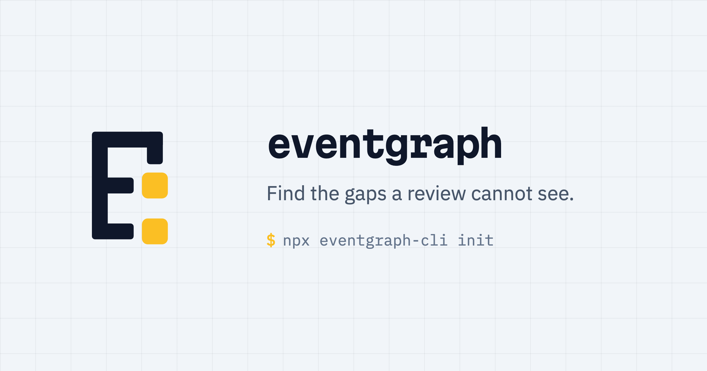

<p align="center">
  <a href="https://igoriuz.github.io/eventgraph">
    
  </a>
</p>

Model an application as a queryable graph instead of a diagram nobody maintains.

Built for agents as much as for people. The model is a file an agent can query
and write, and `check` asks *which relationship is missing* rather than *does
this look right* — a question with an answer, so the loop needs no taste and no
screenshot.

## Install

```bash
npx eventgraph-cli init           # scaffold a project, nothing to install
npm install -g eventgraph-cli     # or keep the CLI around

eventgraph check --next 3         # the gaps worth closing first
eventgraph slice <event>          # the flow around one event
```

## Give it to your agent

```bash
npm install -g eventgraph-mcp
claude mcp add eventgraph -- eventgraph-mcp
```

The server has no configuration of its own — it finds the project by walking up
from wherever it starts, so register it per repository. Every other client takes
the same stdio command; [MCP](#mcp) covers Codex, Cursor, Zed and the tools it
exposes.

The premise: event modeling is right about the *shape* of a flow — actor →
command → event → read-model → screen — and wrong about the *storage*. A
swimlane board is a view, not a data structure, which is why it fragments once
cross-cutting concerns show up. Here the graph is the storage and the board is
one projection of it, rebuilt on demand around whatever you ask about.

Most of the value is not the graph itself. It is `check`: an agent or a human
writing the model gets told which gaps are structurally impossible to leave
open, so the loop becomes `check --next` → fill one gap → `check` → repeat.

There is a landing page at <https://igoriuz.github.io/eventgraph> with a live
viewer and the whole rule catalogue. It is built from `site/`, and its findings
are regenerated from `site/demo` on every deploy rather than written by hand.

## Layout

```
eventgraph/
  eventgraph.yaml            name, preset, contexts, platforms
  contexts/<name>/model.yaml nodes and edges for one bounded context
```

Node ids are unique within a context, so a `booking` aggregate and a `booking`
screen can coexist. Commands accept bare ids (`placed`) when unambiguous, or
qualified ones (`app.placed`).

```yaml
context: app
nodes:
  customer:     { type: actor }
  place-order:  { type: command, src: src/orders/place.ts }
  order-placed: { type: event, src: src/orders/place.ts, terminal: nothing reacts yet }
edges:
  issues:   { customer: [place-order] }
  produces: { place-order: [order-placed] }
```

A node is `type`, an optional `label` (derived from the id when absent), an
optional `src` pointing at real code, and then whatever semantic flags apply.
Naming `src` is what makes a node implemented, so there is no separate `status`
line to keep in sync. Edges group by type, then by source.

Edges are first-class and typed, and the preset decides which type may connect
which — a command that "produces" an actor fails validation rather than quietly
producing a nonsense graph.

## Commands

```
eventgraph init --yes               scaffold a project, no prompts
eventgraph apply                    merge a model from a file or stdin
eventgraph add / connect            write one node or edge
eventgraph migrate                  rewrite older contexts in the compact form
eventgraph scaffold                 extract a partial model from source
eventgraph list / query             read the graph
eventgraph validate                 shape: are types and edges legal?
eventgraph check                    completeness: what is missing?
eventgraph check --next 3           the most pressing gaps, in priority order
eventgraph verify                   do pointers resolve, do callers know the rejections?
eventgraph slice <event>            the swimlane around one event
eventgraph lifecycle <aggregate>    its events, the closing one last
eventgraph impact <node>            blast radius of a change
eventgraph view                     HTML viewer
eventgraph rules                    every rule, and why it exists
```

`--json` for machine-readable output on most of them.

### Don't render everything

A whole-graph picture stops being readable within a few dozen nodes — the same
failure that kills a growing swimlane board. Ask for a part instead:

```
eventgraph view --slice order-placed        the flow around one event
eventgraph view --focus place-order -d 2    two hops around a node
eventgraph view --type command,event        one lane at a time
```

Every view prints how much of the graph it shows, so a narrowed picture is never
mistaken for the whole one. In the viewer, clicking a node dims everything
outside its neighbourhood; Escape clears it.

## validate vs check

`validate` asks whether the graph has a legal *shape*: known node types, known
edge types, edges connecting the types the preset allows.

`check` asks whether it is *complete* — a different question, and the one that
finds real problems. Completeness rules only make sense once a preset fixes the
vocabulary ("this event has no consumer" means nothing without a definition of
event), so they are opt-in per preset via a `rules:` key. A preset without one
keeps shape-only validation.

Rules run in five lanes; `check --lane <lane>` narrows to one.

**bootstrap** — an empty graph must not report success, or the plan-forward loop
has nothing to pull on: no nodes at all, no actor, no aggregate.

**structure** — an event nothing consumes or nothing produces; a read-model
nothing reads; a command nothing issues or that produces nothing; a screen that
neither reads nor offers; a policy missing either half of event-in/command-out;
an invariant no command enforces; an aggregate without events or without a
lifecycle end; an open question blocking other nodes.

**ux** — structural only; nothing about visual design, copy or layout, which are
not graph problems.

- **a command whose outcome the actor never sees.** Every screen looks fine on
  its own, which is why reviews miss it. Followed transitively through policy
  chains, since feedback often surfaces only after a policy turns the event into
  another command.
- a screen no navigation path reaches from an entry screen
- a screen with no action and no way onward
- a command buried more than three navigations deep
- a screen offering an actor a command they may not issue

**backend** — silent unless the model describes one; see below.

- an endpoint that names no caller
- a policy not declared idempotent, though redelivery is guaranteed
- one reaction writing across several aggregates, which cannot be atomic
- a projection that does not state whether reads are immediate or eventual
- a command upholding an invariant but modelling no rejection
- a rejection silenced by `terminal`

**platform** — see below.

### Saying "yes, deliberately"

A rule that cannot be told it is wrong becomes noise. These flags live in a
node's `data` and each one that silences a finding demands a reason:

| Flag | On | Means |
| --- | --- | --- |
| `terminal: <reason>` | event | nothing reacts, deliberately |
| `ends_lifecycle` | event | closes an aggregate — orthogonal to `terminal`, since a closing event is often still displayed |
| `transient: <reason>` | event | no aggregate owns it because no state survives it, e.g. a generated file |
| `immortal` | aggregate | genuinely never ends |
| `detail` | screen | a lightbox; having no action and no way onward is the point |
| `kind` | screen | which surface this is; only `screen` is navigated to |
| `public: <reason>` | screen | an endpoint deliberately callable without a named caller |
| `triggered_by` | command | issued by a scheduler or by a screen appearing |
| `external: <reason>` | command | hands off to a system surface, so no outcome is observable |
| `failure` | event | records a refusal rather than a success |
| `idempotent` | policy | safe to run twice, as at-least-once delivery requires |
| `consistency` | read-model | `immediate` or `eventual` — whether a reader sees its own write |
| `entry` | screen | where the app opens; reachability is measured from here |
| `headless` | actor | a sensor, scheduler or partner system — nothing to look at, so feedback rules do not apply |
| `retried: <reason>` | actor, command | the sender repeats until it lands, so a refusal is not lost |
| `subscribable: false` | aggregate | the store refuses readers outright, so nothing written here can ever be displayed |
| `rejects: [CODE, …]` | command | the refusals it can answer with; `verify` holds callers to them |

### Actors that cannot look

`command-no-feedback` asks whether the actor who issued a command can see what
became of it. That is a real defect for a person and a category error for a
device: a bridge reading emulator RAM has no screen, so measuring it against
one reports every command it issues and tells you nothing.

Marking the actor `headless` exempts it and asks the question that does apply
instead. A refusal a sensor cannot see is data that silently never arrives, so
`headless-rejection-lost` reports any command it issues that an invariant may
reject, unless either

- the sender retries — `retried` on the actor or the command, or
- a `decision` points at the command with `affects`, owning the loss on
  purpose.

The second is the common answer, because dropping is often correct: retrying a
domain rejection would never succeed. What the flag buys is that the trade-off
is written down where the next reader will find it, rather than implied by a
rule that stayed quiet.

### State nothing may read

`event-no-consumer` says nobody reads this yet. `unreadable-state` says nobody
*can*, because the store refuses readers: a table declared without a public
flag, a collection with no read rule, a private field.

The difference matters because the first is a gap someone closes by writing a
subscription and the second cannot be closed from the reading side at all. Both
halves get built and both work — the writer writes, the display renders — and
the display stays empty forever. Nothing in either file is wrong, which is why
this survives review.

`subscribable: false` on an aggregate turns that into a finding on every
non-terminal event written there. The SpacetimeDB scaffold sets it from the
table declaration, since visibility there is a keyword rather than a guess.

## Backends

The core vocabulary is backend vocabulary to begin with — command, event,
aggregate, invariant and policy all come from there. The only app-shaped node
is `screen`, and a screen is really *the outside edge of the system*: where an
actor touches it and where feedback lands. In a backend that edge is an HTTP
endpoint, a queue consumer or a scheduled worker, so it stays one node type
discriminated by `data.kind`:

```yaml
- id: orders-api
  type: screen
  label: POST /orders
  data:
    kind: endpoint
```

Backend kinds are never navigated to, so reachability, entry and dead-end rules
skip them. Of the three only `endpoint` answers its caller, so only it counts as
feedback — routing an outcome to a `consumer` or a `job` means nobody sees it,
and `command-no-feedback` still fires.

The lane switches itself on as soon as the model declares a backend surface. A
headless service with no inbound surface at all says so in `eventgraph.yaml`:

```yaml
backend: true
```

Nothing else opts in, so adding the lane cannot start reporting on app models.

For several services, the platform lane doubles as contract-drift detection:
declare `platforms: [orders, billing]` and a node implemented in one service but
not the other reports — the same "information lives between the repositories"
problem as iOS versus Android.

## Drift between graph and code

`implemented_by` holds pointers into real source, optionally with a `#symbol`
suffix. `eventgraph verify` checks that those files still exist, so a graph
cannot silently describe code that was renamed away. Nodes marked
`status: implemented` that name no source are reported too.

```
eventgraph verify --root ../          resolve pointers from the repo root
```

### Contracts with an end in each codebase

The same command also checks something no linter can reach from inside one
repository. A command's `rejects` lists the refusals it can answer with; an
actor's `implemented_by` says where the caller lives. Put together, the graph
holds both ends of a contract that neither side can see whole:

```yaml
bridge:        { type: actor, src: [bridge-csharp] }
report-party:  { type: command, rejects: [INVALID_PARTY_DATA, RATE_LIMITED] }
```

With an `issues` edge between them, `verify` searches the actor's source for
each code it can be answered with. A code that appears nowhere is reported. The
failure this catches is mundane and near-invisible: a service gains a rejection,
every test on both sides still passes, and the caller quietly treats the new
code as unknown — dropping the message, or retrying something that will never
succeed.

Matching is a substring search across whatever languages the callers are
written in, which is the point: a parser per language is not worth owning to
find a constant that is missing entirely. Two honest limits follow. A code
mentioned only in a comment counts as handled, and one assembled at runtime is
not found. It catches the ordinary case, and a false pass is cheaper than a
check nobody runs.

## Two codebases, one product

When the same product ships as separate apps, `implemented_by` can be keyed by
platform, with the expected set declared in `eventgraph.yaml`:

```yaml
platforms: [ios, android]
```

```yaml
- id: upload-protocol
  type: command
  data:
    implemented_by:
      ios: []
      android: [app/src/main/java/protocol/ProtocolUploadWorker.kt]
```

A missing or empty entry is drift. A flat list still means "not
platform-specific", so shared domain nodes never report. This is the one check
no linter or test can perform from inside a single repository, because the
information lives between them.

## Starting from code

Transcribing an existing application by hand is the expensive part, and most of
it is mechanical:

```
eventgraph scaffold --root ../ --context app | eventgraph apply -
```

It reads HTTP route registrations into endpoints, screens and the navigation
between them, and ORM table declarations into candidate aggregates. Screens are
found however the framework declares them: in the file tree, in a `GoRoute`
table, or in a `<Route>` element — and a router names screens without
implementing any, so `implemented_by` points at the component's own file. A
route registration binds a handler and a client call does not, which is how a
repository holding both tiers avoids counting every endpoint twice.

Commands, events, policies and invariants are deliberately *not* guessed. Those
are the modelling, and a graph that invented them would look finished while
being wrong — which is worse than one that is obviously partial. What comes out
is a skeleton with `check` pointing at everything still missing.

### When the module already says it

Some backends write the domain down rather than leaving it to be inferred. A
SpacetimeDB module is the clear case: a reducer *is* a command, the tables it
writes are the aggregates it acts on, and where the module keeps an event log
the inserted row names the event outright. There the scaffold reads the write
model instead of guessing it, and says so.

Two things make the difference between that working and half-working. Effects
are followed through module-local helpers, because a codebase that has been
deduplicated at all has moved its interesting writes out of the reducers — read
only the reducer body and you miss exactly the paths worth factoring out. And
on the client the seam is the subscription: `useTable(tables.encounter)` is a
screen reading a projection and `conn.reducers.logEncounter(…)` is a screen
offering a command, each credited to every screen importing the component it
sits in.

Even here the graph stays partial. Actors, policies, invariants, and which
aggregate an event belongs to are still the modelling — an event row carrying
three foreign keys does not say which one owns it.

The document goes to stdout and the notes to stderr, so it is worth reading the
middle before piping it: the entry screen, the aggregate names and whether each
table really owns state are all guesses.

## Writing a model

Describing an application one `add` at a time takes hundreds of calls, so the
bulk path is a document:

```
eventgraph apply model.yaml         merge it in
eventgraph apply -                  the same, from stdin
eventgraph apply - --dry-run        what would change
eventgraph apply - --replace        replace the named contexts wholesale
```

Several contexts can arrive in one input, separated by `---`, and a context the
input names but the project does not have is created and registered. The merged
result is validated *before* anything is written, so a batch with one bad edge
leaves the project exactly as it was rather than half-applied.

Single edits still work and now reach the whole vocabulary:

```
eventgraph add screen orders-api --set kind=endpoint --src src/api.ts
eventgraph connect orders-api place-order --type offers
```

Edits go through the YAML document tree, so the comments around a change
survive it.

## MCP

```
npm install -g eventgraph-mcp

claude mcp add eventgraph -- eventgraph-mcp        Claude Code, this machine
claude mcp add -s project eventgraph -- eventgraph-mcp   committed as .mcp.json
```

Other clients take the same command through their own config — the common
`mcpServers` block (Cursor, Windsurf, Zed, Claude Desktop), `servers` in
`.vscode/mcp.json`, or `[mcp_servers.eventgraph]` in `~/.codex/config.toml`.
Anything that can run a stdio command works; there is no environment, token or
port. The server finds the project by walking up from the directory it is
started in, so register it per repository.

The server exposes the read side to agents: `eventgraph_query`,
`eventgraph_impact`, `eventgraph_slice`, `eventgraph_lifecycle`,
`eventgraph_check`, `eventgraph_validate`, plus writes gated by the `agent.write`
mode in the project config (`prompt`, `auto` or `locked`).

## Development

```
pnpm install
npx vitest run                     the whole suite
pnpm --filter eventgraph-core build
```

Packages: `core` (graph, rules, projections, verify), `cli`, `mcp`, `viewer`.
Core carries no dependencies beyond `yaml` and `ajv`; the others are thin
adapters over it.
